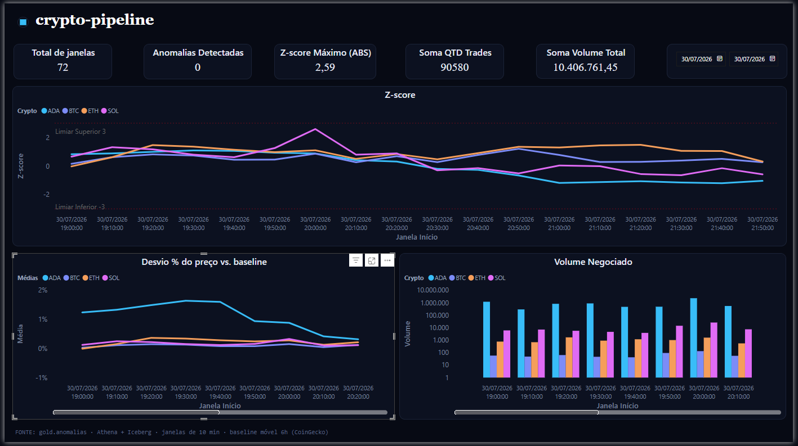
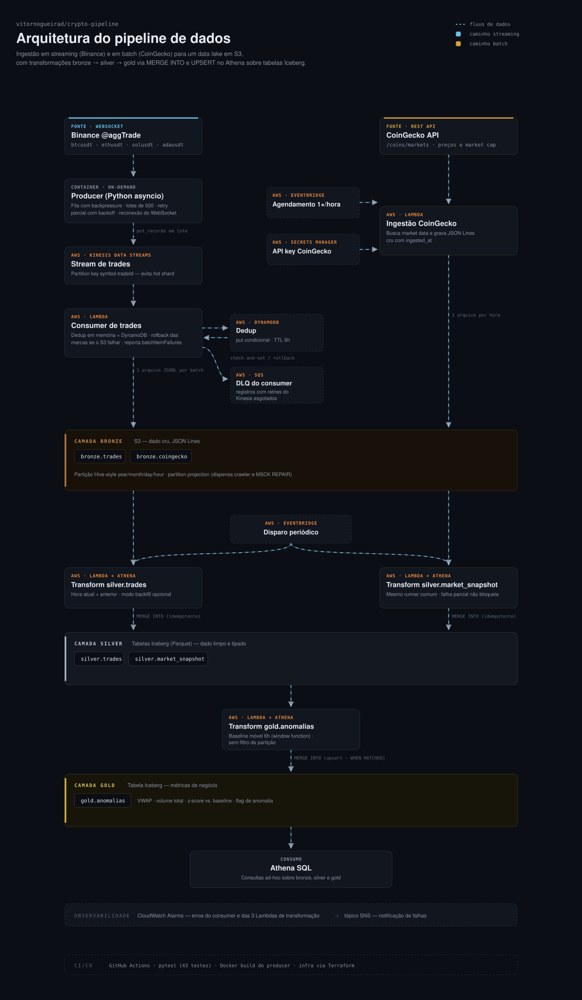

# 🪙 crypto-pipeline

Pipeline de dados end-to-end para detecção de anomalias de preço e volume em criptoativos, combinando ingestão **batch** (baseline histórico) e **streaming em tempo real** (sinal de mercado), 100% em AWS com infraestrutura como código.

## Contexto e motivação

Preço de um ativo, isolado, diz pouco. O que importa é o **desvio em relação ao comportamento recente**. Este projeto constrói duas fontes de dados complementares para permitir essa comparação:

- **CoinGecko (batch)** — captura periódica de preço/volume/market cap, servindo como **baseline histórico** de cada ativo.
- **Binance WebSocket (streaming)** — trades em tempo real (`aggTrade`), servindo como **sinal ao vivo** do mercado.

A camada `gold.anomalias` cruza as duas fontes para identificar quando o comportamento em tempo real se desvia do padrão histórico recente — o objetivo final do pipeline.

Ativos monitorados: **Bitcoin, Ethereum, Solana, Cardano** (BTC, ETH, SOL, ADA).



## Arquitetura




 Por baixo de tudo: Glue Data Catalog (bronze/silver/gold) + Athena Workgroup
 (trava de custo por query) + CloudWatch Alarms/SNS nas 3 Lambdas de transformação


## Status do projeto

| Etapa | Descrição | Status |
|---|---|---|
| 1 | Ingestão batch (Lambda + EventBridge + S3 + Secrets Manager + Budgets) | ✅ Implantado e validado |
| 2a | Infra de streaming (Kinesis + Lambda consumer + DynamoDB + SQS DLQ + CloudWatch) | ✅ Validado end-to-end, efêmero (destruído/recriado por ciclo) |
| 2b | Producer WebSocket Binance (async, resiliente, testado) | ✅ Completo |
| 3 | Silver layer (Athena + Iceberg): tipagem, dedup residual, backfill | ✅ Completo, validado com dado real |
| 4 | Gold layer (`gold.anomalias`): VWAP + baseline móvel + z-score | ✅ Completo, validado com dado real |
| 5 | Power BI conectado ao Athena | ✅ Completo, validado com dado real

## Stack técnico

- **Ingestão:** Python (`asyncio`, `websockets`, `boto3`), AWS Lambda
- **Streaming:** Amazon Kinesis Data Streams (on-demand)
- **Dedup (bronze):** Amazon DynamoDB (conditional writes)
- **Storage bronze:** Amazon S3 (JSON, particionado Hive + partition projection)
- **Storage silver/gold:** Amazon S3 + **Apache Iceberg** (particionamento oculto, `MERGE INTO`, schema evolution)
- **Motor de transformação:** **Amazon Athena** (SQL, serverless — sem cluster Spark)
- **Metastore:** **AWS Glue Data Catalog**
- **Orquestração das transformações:** EventBridge (schedule) → Lambda → `athena.start_query_execution()`
- **Observabilidade:** CloudWatch (alarms, logs, métricas), SNS (e-mail), SQS (dead-letter queue)
- **IaC:** Terraform (módulos por etapa: `infra/`, `infra/streaming/`, `infra/athena/`)
- **Testes:** pytest, pytest-asyncio, mocks de boto3 (sem custo de AWS real)
- **CI:** GitHub Actions
- **Visualização:** Power BI (conector nativo Athena via ODBC)

## Estrutura do repositório

```
crypto-pipeline/
├── infra/
│   ├── (Etapa 1 — batch: Lambda, S3, Secrets, Budgets, IAM)
│   ├── streaming/     (Etapa 2a — Kinesis, consumer Lambda, DynamoDB, SQS, alarms)
│   └── athena/         (Etapa 3+4 — Glue DBs, Workgroup, staging bucket, 3 Lambdas,
│                         EventBridge, IAM, alarmes SNS)
├── sql/
│   └── ddl/            (DDL rodado manualmente 1x — bronze, silver e gold)
│       ├── bronze_tables.sql
│       ├── silver_tables.sql
│       └── gold_tables.sql
├── src/
│   ├── ingestion/coingecko/handler.py       # Lambda de ingestão batch
│   ├── consumer/trades/handler.py           # Lambda consumer do Kinesis
│   ├── producer/binance/producer.py         # Producer WebSocket → Kinesis
│   └── transform/
│       ├── common/                          # compartilhado pelas 3 Lambdas de transformação
│       │   ├── athena_executor.py           # dispara query, faz polling até concluir
│       │   ├── partitions.py                # calcula partições (hora atual + anterior)
│       │   └── transform_runner.py          # orquestra partições, modo incremental/backfill
│       ├── silver/
│       │   ├── trades_handler.py            + silver_trades_merge.sql
│       │   └── market_snapshot_handler.py   + silver_market_snapshot_merge.sql
│       └── gold/
│           └── anomalias_handler.py         + gold_anomalias_merge.sql
├── tests/               (43 testes — producer, consumer, ingestão, silver, gold)
└── .github/workflows/ci.yml
```

## Como rodar localmente

**Testes** (sem AWS real, tudo mockado):
```bash
python -m pytest tests/ -v
```

**Producer contra a Binance real** (requer credenciais AWS e infra de streaming aplicada):
```powershell
$env:KINESIS_STREAM_NAME = "<nome do stream>"
$env:AWS_REGION = "us-east-1"
$env:AWS_PROFILE = "<seu profile>"
$env:SYMBOLS = "btcusdt,ethusdt,solusdt,adausdt"

python src/producer/binance/producer.py
```

**Infraestrutura** (cada módulo é aplicado/destruído independente — states separados):
```powershell
cd infra\athena     # ou infra\streaming, ou infra\ (raiz)
terraform init
terraform plan -out=tfplan
terraform apply tfplan
```

**Disparo manual de uma Lambda de transformação** (fora do schedule do EventBridge):
```powershell
# Modo incremental (padrão — hora atual + anterior)
aws lambda invoke --function-name crypto-pipeline-silver-trades-transform --profile <profile> --payload '{}' out.json

# Modo backfill (carga histórica, uma vez só)
aws lambda invoke --function-name crypto-pipeline-silver-market-snapshot-transform --profile <profile> --payload '{"backfill": true}' out.json
```
No Windows, se o `--payload` inline der erro de encoding, use o console do Lambda (aba **Test**) — mais confiável que lidar com escaping de aspas no PowerShell.

## Decisões de arquitetura

### Ingestão e streaming (bronze)

**Kinesis Data Streams (on-demand)** foi escolhido pelo alinhamento entre modelo de cobrança e perfil de uso: cobra por volume ingerido, sem infraestrutura ociosa, adequado a um producer que roda sob demanda, não 24/7.

**Partition key: `symbol + aggTradeId`.** Evita hot shards, se a chave fosse só o símbolo, os 4 ativos concentrariam trades em poucas partições. A ordenação temporal necessária para análise não depende da partição: o campo `trade_time`, embutido no registro, é usado para agregação por janela na leitura.

**`@aggTrade` em vez de `@trade`.** Agrega múltiplas execuções ao mesmo preço em um único evento — menos mensagens, mesma informação relevante.

**Producer assíncrono com fila interna produtor-consumidor.** Duas corrotinas conectadas por uma `asyncio.Queue`: uma recebe do WebSocket continuamente, outra drena e envia ao Kinesis em lote — desacopla a taxa de chegada da taxa de flush.

**Producer on-demand, não Fargate 24/7.** O producer roda sob demanda (execução local ou container pontual para janelas de captura), não como serviço contínuo no Fargate. A decisão é de custo-benefício: manter um container 24/7 gera custo fixo contínuo desproporcional para um pipeline de portfólio

**`boto3` síncrono via `asyncio.to_thread`, aioboto3/aiobotocore foram avaliados e descartados.** O aiobotocore implementa async sobrescrevendo métodos internos (não-públicos) do botocore, o que o obriga a pinnar o botocore em faixas de versão estreitas, histórico documentado de conflitos de dependência downstream. O ganho de I/O nativamente assíncrono só compensa sob alta concorrência de chamadas à AWS; no projeto é um put_records a cada ~2s. boto3 síncrono despachado via asyncio.to_thread é o padrão recomendado pela documentação do asyncio para bibliotecas de I/O síncronas em contexto assíncrono: não bloqueia o event loop (nem o WebSocket) e mantém dependência apenas no SDK oficial, sem acoplamento a internals.

**Resiliência do producer.** Retry limitado a 3 tentativas com backoff exponencial, sem recursão infinita, que travaria o loop de envio. Ao esgotar tentativas, os trades voltam à fila principal em vez de serem descartados. Se a fila estiver cheia no reenfileiramento, descarta com log.

**Shutdown gracioso no Windows.** `loop.add_signal_handler()` sempre levanta `NotImplementedError` no Windows — o handler gracioso nunca é instalado localmente. O `KeyboardInterrupt` é capturado no entrypoint (`try/except` em torno do `asyncio.run()`) pra evitar traceback cru no Ctrl+C local. Em produção (container Linux), o shutdown gracioso completo funciona normalmente.

**Deduplicação via DynamoDB (conditional writes).** `attribute_not_exists` como condição de escrita garante idempotência distribuída. A alternativa (`dropDuplicates` na silver) exportaria o problema de dedup pra uma etapa posterior, menos rastreável. Otimizações: dedup em memória dentro do próprio lote + `ThreadPoolExecutor` de 25 workers reduziram o tempo de processamento de ~3.5s para ~140ms. TTL de 6h no DynamoDB é suficiente pra cobrir reprocessamento sem acumular estado indefinidamente.

**1 arquivo por lote.** Trade-off consciente do problema de small files, priorizando rastreabilidade lote → arquivo. ESM: até 500 registros ou 10s, o que ocorrer primeiro.

**Confiabilidade do Event Source Mapping (ESM).** `ReportBatchItemFailures` (falha parcial, não tudo-ou-nada) + `BisectBatchOnFunctionError` (isola o registro problemático) + `MaximumRetryAttempts=3` + `MaximumRecordAgeInSeconds=3600`, com SQS DLQ como destino final.

**Padrão saga/compensação.** Se a marca de dedup é gravada no DynamoDB mas a escrita no S3 falha depois, o handler executa `delete_item` de compensação (rollback best-effort). O TTL de 6h é a salvaguarda pra qualquer rollback que também falhe.

**`IteratorAge` como métrica de lag.** Indicador de disponibilidade (SLI) do streaming — se crescer, o consumer processa mais devagar do que os dados chegam.

**Retenção do Kinesis: 24h (padrão).** Kinesis é transporte, não storage — os dados persistem no S3; a retenção só cobre uma eventual janela de reprocessamento.

**`price`/`quantity` como STRING até a silver.** A Binance envia esses campos como string intencionalmente. Converter para `float` no bronze introduziria erro de arredondamento binário (`0.1+0.2=0.30000000000000004`). A tipagem correta (`DecimalType`/`DECIMAL(38,8)`) acontece na silver, onde os cálculos de fato ocorrem.

### Silver layer

**Motor: Athena (SQL)** O trabalho necessário (cast de tipo, parse de timestamp, dedup residual, união lógica) é inteiramente expressável em SQL declarativo — não exige processamento distribuído. Athena cobra só por TB escaneado, sem cluster nem tempo mínimo de warm-up.

**Formato de tabela: Apache Iceberg (silver/gold), não tabelas Hive convencionais.** O formato de arquivo continua sendo Parquet, Iceberg é a camada transacional de metadados sobre ele. Resolve dois problemas reais que apareceram durante o desenvolvimento: schema evolution (adicionar/alterar coluna sem recriar a tabela nem reprocessar histórico) e MERGE INTO/upsert nativo e atômico, sem ele, cada atualização da gold exigiria ROW_NUMBER() + INSERT OVERWRITE manual: reescrita da partição inteira, sem atomicidade em caso de falha no meio da operação. A bronze permanece como external table Hive convencional com partition projection, dado imutável append-only não precisa de transação.

**Particionamento oculto (`PARTITIONED BY (day(ingested_at))`), não pastas manuais.** O Iceberg gerencia partição no metadado da tabela, não existe mais `year=/month=/day=/hour=` como estrutura física que a query precisa conhecer. Interação sempre via SQL; a organização física interna (inclusive nomes de arquivo/diretório gerados pelo engine) pode mudar entre versões sem quebrar nada.

**Bronze com partition projection, não Crawler/MSCK REPAIR.** O Athena calcula as partições existentes a partir do padrão de path na hora da query, dispensando um Crawler agendado ou uma chamada explícita de `MSCK REPAIR TABLE` a cada nova hora criada.

**Dois databases Glue via Terraform, tabelas via script DDL manual.** Mesma lógica do `secrets.tf`: infraestrutura (recurso com ARN, IAM associada) via Terraform; schema (DDL de tabela) via script, rodado uma vez.

**Renomeação de `_ingested_at` → `ingested_at` na fonte (nos handlers), com compatibilidade retroativa no schema.** Identificador começando com `_` exige aspas em toda query Trino, e crase (não aspas simples) na sintaxe DDL Hive usada no `CREATE EXTERNAL TABLE`, dois dialetos diferentes dentro do mesmo Athena. Como já existiam arquivos gravados com o nome antigo (batch acumulado da CoinGecko, considerado valioso pra gold), a tabela bronze declara as duas colunas e o `MERGE INTO` usa `COALESCE(ingested_at, _ingested_at)` sem perder histórico nem precisar reprocessar/renomear nada no S3.

**Coluna `asset_symbol` normalizada em ambas as tabelas silver.** `"BTCUSDT"` (Binance) e `"btc"` (CoinGecko) apontam pro mesmo ativo com grafias diferentes. Resolvendo uma vez na silver (`regexp_replace(symbol, 'USDT$', '')` / `upper(symbol)`), o join da gold fica direto por `asset_symbol`, sem repetir esse de-para em toda query downstream.

**`MERGE INTO` com `WHEN NOT MATCHED THEN INSERT` apenas (não UPDATE) na silver.** Trade e snapshot são eventos imutáveis — uma vez inseridos, não são alterados. A chave natural do `MERGE` (`trade_id` pra trades; `(id, last_updated)` pra market_snapshot) garante idempotência: reprocessar uma partição já processada não duplica.

**Modo backfill separado do modo incremental, no mesmo handler.** A Lambda de silver processa por padrão só a hora atual + hora anterior (`particoes_a_processar()`), pensada pra operação contínua. Dado histórico que já existia antes da Lambda começar a rodar (batch acumulado da CoinGecko) nunca seria alcançado por esse modo. Solução: o handler aceita um payload opcional `{"backfill": true}`, que troca o filtro de partição por `1=1` (tabela inteira, uma vez). O disparo automático do EventBridge nunca ativa esse modo (evento vazio não tem a chave), e mesmo que fosse acionado por engano, o `MERGE` idempotente não duplicaria nada — só gastaria uma query extra.

**Diagnóstico de janela de agregação com dado real, não estimativa a priori.** Antes de fixar o tamanho da janela usada na gold, uma query mediu quantos trades caem em cada janela candidata (5/10/15/20 min), por ativo, descartando a primeira e a última janela de cada grupo, que são truncadas pelo instante exato em que o streaming começa/termina e distorcem o mínimo real. Decisão (10 min) baseada no ativo mais fraco (ADA) não ganhar estabilidade adicional entre 5 e 15 min, só perdendo responsividade.

### Gold layer (`gold.anomalias`)

**Baseline é uma janela móvel recalculada, não um ponto fixo de calendário.** O "normal" de um ativo não é definido por um valor fixo (ex: mesma hora de ontem/mês passado/ano passado) — não há sazonalidade de calendário relevante em cripto que justifique esse modelo. O baseline é a média e o desvio padrão do CoinGecko nas **últimas 6h antes de cada momento**, recalculado a cada execução via window function (`RANGE BETWEEN INTERVAL '6' HOUR PRECEDING AND CURRENT ROW`).

**Preço representativo da janela de streaming: VWAP, não média simples.** `SUM(price*quantity)/SUM(quantity)` pondera pelo volume de cada trade, um trade pequeno a um preço atípico não deveria pesar igual a um trade grande, e a média simples deixaria isso acontecer.

**Detecção via z-score, limiar de 3 desvios padrão.** `(preço_vwap_da_janela - baseline_média) / baseline_desvio`. Convenção estatística padrão ("regra dos 3 sigma"), ajustável depois de observar dado real em produção.

**Agregação de trades em janelas de 10 minutos.** Decidido com base no diagnóstico de trades-por-janela descrito na seção de silver — equilíbrio entre estabilidade estatística (evitar que poucos trades numa janela pequena gerem médias ruidosas, produzindo falso positivo) e responsividade.

**As-of join via `JOIN` + `ROW_NUMBER()`, não subquery correlacionada dentro do `ON`.** Presto/Trino (motor por trás do Athena) tem suporte limitado a subquery correlacionada na cláusula `JOIN ... ON`. O padrão robusto: `JOIN` trazendo todos os snapshots do CoinGecko anteriores ou iguais ao fim da janela de trade, depois `ROW_NUMBER() OVER (... ORDER BY ingested_at DESC)` pra escolher só o mais recente (`rn = 1`).

**`MERGE INTO` com upsert (`WHEN MATCHED THEN UPDATE`), diferente do padrão insert-only da silver.** Trade e snapshot são imutáveis; o resultado agregado da gold não é — o `z_score` de uma janela já calculada pode mudar se chegar um snapshot novo do CoinGecko que revise o baseline dela.

**Query da gold sem parametrização por partição, diferente das Lambdas de silver.** O baseline móvel é window function sobre a tabela inteira de `silver.market_snapshot` — não dá pra restringir a "hora atual + anterior" sem quebrar o cálculo, que depende de ver as 6h de histórico antes de cada linha. Trade-off assumido: a query recalcula tudo a cada execução; a escala de dado que o projeto processa hoje deixa isso barato o suficiente.

### Infraestrutura e operação

**Athena Workgroup dedicado com `bytes_scanned_cutoff_per_query`.** Trava de custo em nível de query (1 GB por padrão, ajustável), equivalente ao AWS Budgets já usado na Etapa 1, mas agindo antes do fato (aborta a query) em vez de só alertar depois.

**Bucket de staging do Athena separado do data lake, com lifecycle de expiração curta.** Resultado de query é dado efêmero (poucos dias de retenção) — não deveria compartilhar bucket nem política de retenção com bronze/silver/gold, que são dado que o projeto quer manter.

**Log groups do Lambda declarados explicitamente, com retenção.** Sem isso, o Lambda cria o log group sozinho na primeira invocação, mas sem expiração — logs acumulam indefinidamente e geram custo crescente sem necessidade.

**Cada módulo Terraform é um root module com state próprio** (`infra/`, `infra/streaming/`, `infra/athena/`). Permite destruir/recriar streaming sem afetar batch, por exemplo — só validado na prática quando a Etapa 2a precisou ser destruída por custo sem tocar no resto. Trade-off assumido: variáveis repetidas (como `alert_email`) precisam ser duplicadas em cada `.tfvars`.

**IAM role única compartilhada pelas 3 Lambdas de transformação**, em vez de uma role por Lambda. As três precisam exatamente do mesmo conjunto de permissões (Athena, Glue Catalog, S3 em bronze/silver/gold, staging bucket) — reaproveitar evita repetir a mesma policy três vezes.

**Import resiliente a dois layouts nos handlers Python.** Cada handler adiciona tanto o próprio diretório quanto o diretório `common/` ao `sys.path` — funciona tanto localmente (`common/` como pasta irmã de `silver/`/`gold/`) quanto dentro do zip do Lambda, onde o Terraform empacota tudo achatado no mesmo diretório via múltiplos blocos `source` do `archive_file`.

## Testes

43 testes unitários cobrindo producer, consumer, ingestão, e as 3 Lambdas de transformação (silver x2 + gold) — rodam sem AWS real (mocks de `boto3` e chamadas HTTP), validados em CI a cada push.

```bash
python -m pytest tests/ -v
```

## Gestão de custos

- Kinesis on-demand, producer sob demanda (não 24/7) — Etapa 2
- Infra de streaming destruída após cada ciclo de validação, recriada via `terraform apply` com `.tfvars` salvo
- Athena Workgroup com `bytes_scanned_cutoff_per_query` — trava por query, não só alerta pós-fato
- Bucket de staging do Athena com lifecycle de expiração (3 dias)
- Log groups com retenção explícita (14 dias) em todas as Lambdas
- AWS Budgets com alertas escalonados desde a Etapa 1

## Roadmap

- [ ] Ajustar o limiar do z-score (hoje 3 desvios) com base em dado real de produção
- [ ] Reavaliar o custo do full-scan da query de gold conforme o histórico crescer